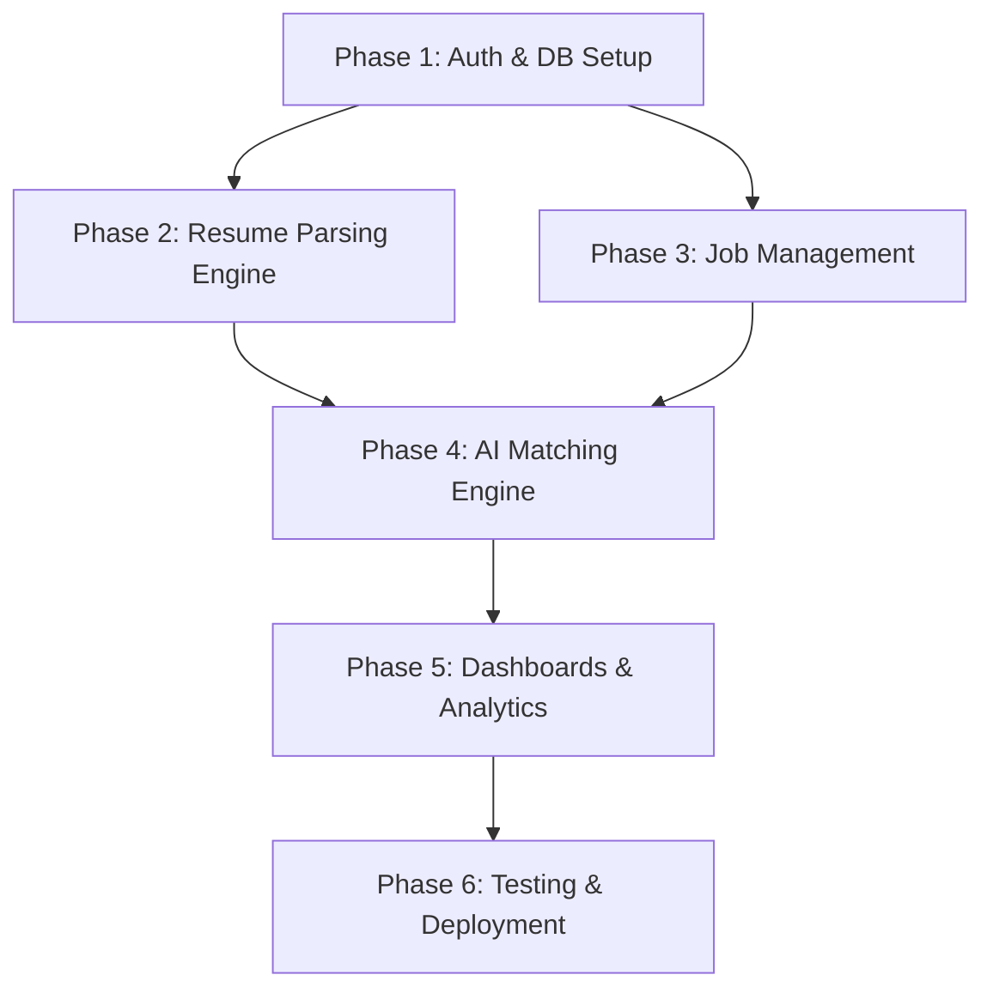

# ResuMatch: Development Roadmap & Phases

Welcome to the development roadmap for **ResuMatch**, an AI-driven Applicant Tracking & Talent Acquisition System (ATATS). This directory contains the detailed specifications, tasks, API endpoints, database schemas, and verification plans for each phase of the development lifecycle.

---

## 🏗️ Technology Stack

| Layer | Technology | Key Libraries / Services |
| :--- | :--- | :--- |
| **Frontend** | React.js | Tailwind CSS, Axios, React Router, Chart.js |
| **Backend** | Python (FastAPI) | PyPDF2, python-docx, spaCy, Regex, PyJWT, bcrypt |
| **Database** | MongoDB | MongoDB Atlas, Motor (Async MongoDB driver) |
| **Storage** | Cloud Storage | Cloudinary / AWS S3 / Firebase Storage |
| **Deployment** | Multi-Platform | Vercel (Frontend), Render/Railway (Backend) |

---

## 📅 Roadmap Overview



### [Phase 1: Authentication & Database Setup](file:///c:/Users/allad/OneDrive/Desktop/resume%20application/development_phases/phase_1_auth_db.md)
*   Establish MongoDB schemas and connection layer.
*   Implement JWT-based RBAC (Role-Based Access Control) authentication.
*   Setup React project structure and common components (auth screens, router).

### [Phase 2: Resume Upload & Parsing Engine](file:///c:/Users/allad/OneDrive/Desktop/resume%20application/development_phases/phase_2_resume_parsing.md)
*   Integrate Cloud Storage for resume files (PDF/DOCX).
*   Build the text extraction and spaCy/Regex parsing pipeline.
*   Create candidate profile management UI and upload zone.

### [Phase 3: Job Management](file:///c:/Users/allad/OneDrive/Desktop/resume%20application/development_phases/phase_3_job_management.md)
*   Implement Job CRUD operations for Recruiters.
*   Build Job application submission APIs.
*   Establish job detail and listing components for both Recruiters and Candidates.

### [Phase 4: AI Matching Engine](file:///c:/Users/allad/OneDrive/Desktop/resume%20application/development_phases/phase_4_matching_engine.md)
*   Formulate and implement the weighted matching score algorithm.
*   Develop automatic candidate ranking categorization.
*   Integrate match-score displays on applicant lists.

### [Phase 5: Dashboards & Analytics](file:///c:/Users/allad/OneDrive/Desktop/resume%20application/development_phases/phase_5_dashboards_analytics.md)
*   Design Recruiter Dashboard with visual job analytics (Chart.js).
*   Design Candidate Dashboard with application status tracking.
*   Implement advanced searching, filtering, and sorting systems.

### [Phase 6: Testing & Deployment](file:///c:/Users/allad/OneDrive/Desktop/resume%20application/development_phases/phase_6_testing_deployment.md)
*   Write unit tests for APIs (pytest) and components (Jest).
*   Configure CI/CD pipelines.
*   Deploy components to Vercel, Render/Railway, and MongoDB Atlas.

---

## 📁 Directory Structure

```text
development_phases/
├── README.md                          # Roadmap Overview (This file)
├── phase_1_auth_db.md                 # Auth & DB Setup Details
├── phase_2_resume_parsing.md          # Resume Upload & Extraction Details
├── phase_3_job_management.md          # Job Creation & Application Details
├── phase_4_matching_engine.md         # Matching Algorithm & Ranking Details
├── phase_5_dashboards_analytics.md    # Dashboards, Filters & Visuals Details
└── phase_6_testing_deployment.md      # Testing, CI/CD & Cloud Deployment Details
```

> [!TIP]
> For each phase, refer to its respective markdown file for full code structures, expected payload schemas, implementation checklist, and verification guidelines.
