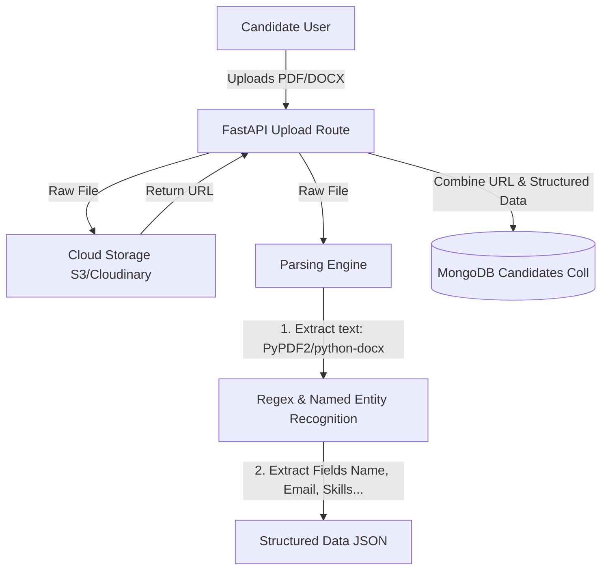

# Phase 2: Resume Upload & Parsing Engine

## 🎯 Objective
Enable candidates to upload resumes (PDF/DOCX formats, up to 10MB) which are stored in Cloud Storage. Implement a Python-based Resume Parsing Engine to extract structured information (name, contact info, skills, experience, education, certifications, and projects) and store this structured data in MongoDB.

---

## 🗄️ Database Design (MongoDB)
This schema links to the base User account and stores the parsed resume contents.

### `candidates` Collection
```json
{
  "_id": "ObjectId",
  "userId": "ObjectId (Ref: users)",
  "name": "String",
  "email": "String",
  "phone": "String",
  "skills": ["String"],
  "experience_years": "Number",
  "education": [
    {
      "degree": "String",
      "field_of_study": "String",
      "institution": "String",
      "year": "Number"
    }
  ],
  "experience_details": [
    {
      "job_title": "String",
      "company": "String",
      "duration": "String",
      "description": "String"
    }
  ],
  "certifications": ["String"],
  "projects": [
    {
      "title": "String",
      "description": "String",
      "technologies": ["String"]
    }
  ],
  "resumeUrl": "String (Cloud Storage URL)",
  "created_at": "ISODate",
  "updated_at": "ISODate"
}
```

---

## 🔌 API Specifications
All resume manipulation routes reside under `/api/resume/`.

### 1. Upload & Parse Resume
*   **Route:** `POST /api/resume/upload`
*   **Headers:** `Authorization: Bearer <token>`
*   **Content-Type:** `multipart/form-data`
*   **Request Params:** `file` (Binary File: PDF/DOCX)
*   **Response (201 Created):**
    ```json
    {
      "message": "Resume uploaded and parsed successfully",
      "candidate_profile": {
        "id": "60d5ec4934d4220015a8b73e",
        "userId": "60d5ec4934d4220015a8b73d",
        "name": "John Doe",
        "email": "john@example.com",
        "phone": "+1-123-456-7890",
        "skills": ["Python", "FastAPI", "React", "MongoDB"],
        "experience_years": 2,
        "resumeUrl": "https://res.cloudinary.com/resumatch/raw/upload/john_doe_resume.pdf"
      }
    }
    ```

### 2. Fetch Resume Profile
*   **Route:** `GET /api/resume/:id`
*   **Headers:** `Authorization: Bearer <token>`
*   **Response (200 OK):** Returns the full candidate document from MongoDB matching the candidate id.

### 3. Delete Resume Profile
*   **Route:** `DELETE /api/resume/:id`
*   **Headers:** `Authorization: Bearer <token>`
*   **Response (200 OK):**
    ```json
    {
      "message": "Resume profile removed successfully"
    }
    ```

---

## 🏗️ Architecture & Implementation Details



### Parsing Pipeline Details
1.  **Text Extraction Layer:**
    *   **PDF:** Extract text contents using `PyPDF2` (or `pdfplumber` for higher extraction fidelity).
    *   **DOCX:** Iterate through paragraphs and tables using `python-docx`.
2.  **Information Extraction Layer:**
    *   **Regex Engine:**
        *   *Email:* `[a-zA-Z0-9._%+-]+@[a-zA-Z0-9.-]+\.[a-zA-Z]{2,}`
        *   *Phone:* `(?:\+?\d{1,3}[-.\s]?)?\(?\d{3}\)?[-.\s]?\d{3}[-.\s]?\d{4}`
    *   **spaCy NLP / Entity Engine (Optional/Recommended):**
        *   Load pre-compiled lists of standard technical skills (1000+ keywords).
        *   Perform Tokenizer/Matcher searches to extract skills, degree classifications, and certifications.
        *   Parse dates to estimate work experience years.

---

## 📝 Phase 2 Checklist
- [ ] Connect Cloud Storage SDK (e.g., Cloudinary or Firebase Storage) for backend upload functions.
- [ ] Write a helper library to convert PDF file streams to plain text strings.
- [ ] Write a helper library to convert DOCX file streams to plain text strings.
- [ ] Develop parsing logic (regex helpers, keyword matches) for contact info and technical skills.
- [ ] Implement experience, certification, and project parsing algorithms.
- [ ] Assemble the main parsing pipeline that updates/creates the `candidates` collection document.
- [ ] Expose upload, get, and delete resume API endpoints.
- [ ] Build the frontend Drag-and-Drop Resume Upload UI component.
- [ ] Design Candidate profile viewer showcasing parsed skills, experience, and contact details.

---

## 🔍 Verification Plan

### Automated Verification
*   **Parsing Test Suite:** Establish mock PDF/DOCX resumes (with known text content) and verify that the parser extracts correct name, skills, and contact data.
    ```bash
    pytest backend/tests/test_parser.py
    ```

### Manual Verification
*   Log in as a candidate, upload sample resumes in both formats, and inspect the dashboard to confirm all fields were populated accurately.
*   Verify that files are stored on Cloud Storage and the corresponding database entry records the correct URL.
