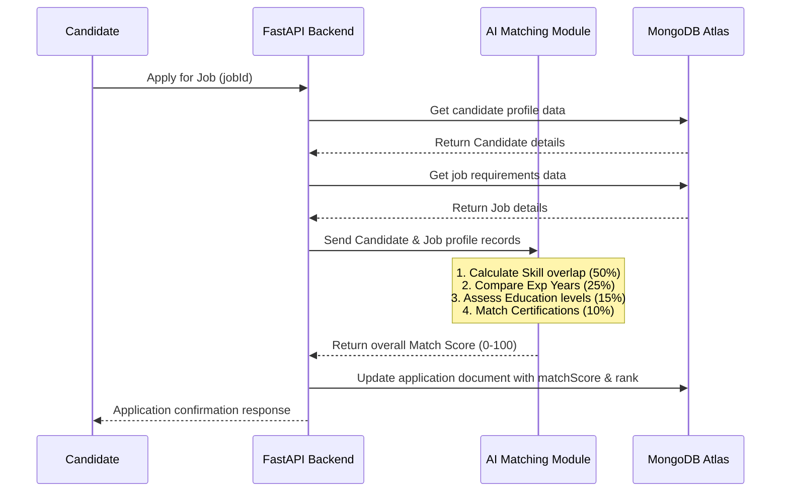

# Phase 4: AI Matching Engine

## 🎯 Objective
Create the core intelligent candidate matching algorithm of ResuMatch. When a candidate applies for a job, calculate a match score ($0$-$100\%$) based on skills, experience, education, and certifications. Automatically categorize and rank applicants to let recruiters view the best matches.

---

## 🧮 Matching Formula & Parameters

The final match score is calculated using the following weights:

$$\text{Match Score} = (\text{Skills Score} \times 0.50) + (\text{Experience Score} \times 0.25) + (\text{Education Score} \times 0.15) + (\text{Certifications Score} \times 0.10)$$

---

### 1. Skills Match (50% Weight)
*   **Logic:** Compares candidate skills against job required skills using set intersection.
*   **Formula:**
    $$\text{Skills Score} = \frac{\left| \text{Candidate Skills} \cap \text{Job Required Skills} \right|}{\left| \text{Job Required Skills} \right|} \times 100$$
*   *Edge Case Handling:* If the job requires 0 skills (unlikely), default to 100%.

### 2. Experience Match (25% Weight)
*   **Logic:** Compares the candidate's total years of experience against the job's minimum requirement.
*   **Formula:**
    *   If $\text{Candidate Experience} \ge \text{Job Required Experience}$:
        $$\text{Experience Score} = 100$$
    *   If $\text{Candidate Experience} < \text{Job Required Experience}$:
        $$\text{Experience Score} = \left( \frac{\text{Candidate Experience}}{\text{Job Required Experience}} \right) \times 100$$

### 3. Education Match (15% Weight)
*   **Logic:** Compares the highest education level of the candidate with the job requirement.
*   **Hierarchy:** High School (1) < Associate (2) < Bachelor's / B.Tech / B.Sc (3) < Master's / M.Tech / M.Sc (4) < Ph.D. (5).
*   **Formula:**
    *   If candidate level $\ge$ job requirement: Score = 100
    *   If candidate level < job requirement: Score = 50 (or fractional relative weight)

### 4. Certifications Match (10% Weight)
*   **Logic:** Matches specified target certification keywords (e.g., "AWS Certified", "PMP", "Scrum Master") if listed or desired.
*   **Formula:** Ratio of matching certifications to job-relevant certifications. If none are specified in the job, the candidate gets 100% for this subsection.

---

## 📊 Ranking Classifications

Candidates are segmented into four distinct categories based on their final Match Score:

| Range | Classification | Theme Color (UI) | Action |
| :--- | :--- | :--- | :--- |
| **85 - 100** | Excellent Match | Emerald Green | Highlight on top, flag for instant review |
| **70 - 84** | Good Match | Mint Green / Teal | Normal review pile |
| **50 - 69** | Moderate Match | Amber / Orange | Optional review |
| **Below 50** | Low Match | Crimson Red | Automated low ranking |

---

## ⚙️ Architecture & Logic Flow



---

## 📝 Phase 4 Checklist
- [ ] Implement the core matching engine python class (`matching_engine.py`).
- [ ] Write helper functions to map education degree strings to ordinal scales.
- [ ] Implement case-insensitive keyword intersection for technical skills.
- [ ] Build the experience comparison calculations, handling cases where requirements are zero.
- [ ] Integrate the matching calculation trigger inside the POST `/api/apply` controller.
- [ ] Update the `applications` collection schema in the backend to store matching calculations.
- [ ] Add an endpoint for recruiters to trigger re-calculations or update match scores manually.
- [ ] Update the Recruiter UI components to display color-coded match scores alongside candidate names.

---

## 🔍 Verification Plan

### Automated Verification
*   **Mathematical Assertions:** Write test suites verifying the math under various mock conditions (e.g. perfect profile match returns 100%, 0 skills matching returns 50% max potential, under-experienced candidate returns proportional ratio).
    ```bash
    pytest backend/tests/test_matching_engine.py
    ```

### Manual Verification
*   Create jobs demanding specific skills (e.g., Python, React) and 5 years experience.
*   Log in as Candidate A (Python, React, 5 years experience) and apply. Verify match score is 100% (Excellent).
*   Log in as Candidate B (Python, No React, 2.5 years experience) and apply. Verify match score is lower, falling in the "Moderate" class. Check MongoDB database properties for the stored values.
