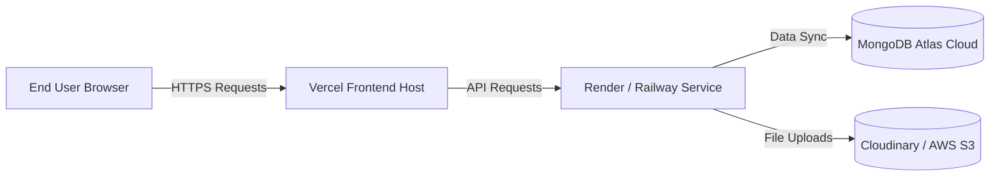

# Phase 6: Testing & Deployment

## 🎯 Objective
Perform end-to-end system validation by running full-suite integration tests, securing production environments, and deploying all components to cloud platforms (Vercel, Render/Railway, MongoDB Atlas).

---

## 🧪 Testing Strategy

### 1. Backend Testing (`pytest`)
*   **Unit Tests:** Verify individual business functions (e.g., matching engine calculations, parsing functions, database model validation).
*   **Integration Tests:** Spawn a test database instance (or mock database collections), make HTTP requests to FastAPI endpoints, and assert status codes, headers, and database payloads.
*   **Test Command:**
    ```bash
    cd backend && pytest -v --cov=app tests/
    ```

### 2. Frontend Testing (`Jest` & `React Testing Library`)
*   **Component Tests:** Test individual components (e.g. upload fields, buttons, dashboard KPI cards) using mocked props.
*   **Routing & Context Tests:** Ensure routing locks block unauthenticated users and redirect them to the `/login` view.
*   **Test Command:**
    ```bash
    cd frontend && npm run test
    ```

---

## 🌐 Production Deployment Architecture



---

## 🚀 Environment Configuration

For deployment, create and configure production-level environment files:

### Backend Production Environment (`.env`)
```ini
ENV=production
MONGO_URI=mongodb+srv://<username>:<password>@cluster0.mongodb.net/resumatch?retryWrites=true&w=majority
JWT_SECRET_KEY=prod_super_secret_jwt_key_9872134098
ACCESS_TOKEN_EXPIRE_MINUTES=1440
CLOUDINARY_URL=cloudinary://<api_key>:<api_secret>@resumatch
PORT=8000
```

### Frontend Production Environment (`.env.production`)
```ini
VITE_API_BASE_URL=https://api.resumatch.render.com/api
```

---

## 🔒 Production Hardening & Security
1.  **Strict CORS Policy:** Define allowed origins explicitly in the FastAPI middleware:
    ```python
    origins = [
        "https://resumatch.vercel.app",
        "https://www.resumatch.com"
    ]
    ```
2.  **Rate Limiting:** Implement API rate limiting using `slowapi` or `fastapi-limiter` (Redis-backed) to prevent denial of service (DoS) attacks on upload paths.
3.  **File Validation:** Limit upload size to exactly 10MB in the API router before stream parsing to avoid memory exhaustion attacks.
4.  **Database Connection Pooling:** Set maximum pool sizes and timeouts on the Motor MongoDB client.

---

## 📝 Phase 6 Checklist
- [ ] Write integration test suites for Authentication, Job Management, and parsing flows.
- [ ] Configure GitHub Actions (or other CI tool) to run tests on pull requests.
- [ ] Deploy MongoDB database cluster on MongoDB Atlas and set up IP whitelist rules (`0.0.0.0/0` for Render dynamic IPs or specific static proxies).
- [ ] Create a Render or Railway account and link the Backend repository. Set up the environment variables.
- [ ] Deploy Frontend to Vercel and configure domain redirects.
- [ ] Test the production environment end-to-end (Register Candidate -> Upload Resume -> Apply to Job posted by Recruiter -> Verify dashboard charts update).
- [ ] Perform a basic security assessment (test JWT spoofing, file upload overflow, and CORS headers).

---

## 🔍 Verification Plan

### Manual Verification
*   Visit the live production URL in an incognito window.
*   Sign up as a recruiter, publish a new job, log out, sign up as a candidate, upload a resume, and apply.
*   Verify that the applicant appears in the recruiter dashboard list with an active matching score.
*   Confirm the entire flow executes with latency under the targeted SLA of 2 seconds.
